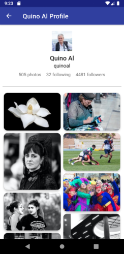

# Unimage Photo Viewer


**Unimage Photo Viewer** is a personal project which provides photos from **Unsplash** using Unsplash API ([The documentation](https://unsplash.com/documentation)). The Unsplash API itself have many common API endpoints such as:

-   Search image
-   Show user profile
-   List user photos
-   Get a photo
-   Get a photo's statistics
-   Get random photos
-   Search for user
-   Search for collections
-   and many more...

To be noted, the Unsplash API uses ***OAuth 2.0 Authentication** (Bearer)* where the user can obtain the **OAuth's access token** by taking the app's **Access Key**, **Secret Key**, and **Redirect URI** from Unsplash Developer App's page. You also need to be registered on Unsplash to create your application first before proceeding OAuth access authentication on your HTTP Client.


## How to install & use?

To enable developers use this project, you need to clone this project, create a file named `apikey.properties` (on project-root level) where the file content itself includes the **Access Key**, **Secret Key, and *****OAuth access token***.

> **NOTE**: You need to include `CLIENT_ID`, `CLIENT_SECRET`, and `ACCESS_TOKEN` on `apikey.properties`, but for `CLIENT_ID` and `CLIENT_SECRET` are optional (required for *non-OAuth* authorized access).

To obtain OAuth access token, you need to create your application on <https://unsplash.com/oauth/applications>, which lists your application name and description. Don't forget to copy it's **Access Key**, **Secret Key**, and **Redirect URI** to your HTTP Client (e.g. Postman) for obtaining ***OAuth access token*** (by enlist your username and password at authentication page).

> 
>
> ^ The example of Access Key and Secret key of your application.

After obtain your OAuth's API key, don't forget to list it on `apikey.properties`. The `apikey.properties` contains following fields:

```
CLIENT_ID="*[ACCESS_KEY]*"
CLIENT_SECRET="*[SECRET_KEY]*"
ACCESS_TOKEN="*[OAUTH_BEARER_TOKEN]*"
```

> **IMPORTANT:** For safety, **don't let the `apikey.properties` to be added or even committed** with other changes!

Then, you're able to compile the project with your bundled **OAuth access token** as your application's API access.


## The components

This application has mainly 3 activities: photo search, photo detail, and user's profile. Each activities has it's own ViewModel and access to libraries using **Dagger**'s dependency injection.

For main Unsplash API URL, the link of [`https://api.unsplash.com`](https://api.unsplash.com/)  is the main API's URL that refers to each endpoint. Please refer to [the documentation](https://unsplash.com/documentation) for detailed documentation.


### Photo Search (MainActivity)

API URL Endpoint: `https://api.unsplash.com/search/photos` 

API Parameters:

- `query`: Query to search
- `page`: Page number to display
- `per_page`: Number of items to display for a page


This activity consists of a `SearchView` and a `RecyclerView` which displays photo grid using `StaggeredGridLayoutManager` which display photos according to their dimension and orientation. Basically, each photo represents photo's URL (thumbnail) which loaded using **Picasso** through `Picasso.get().load(imageUrl).into(imageView)`.

When the app launches, the activity shows only search bar and a blank view where it displays search photo result based on your search query.


### Photo Detail (PhotoDetailActivity)

API URL Endpoint: `https://api.unsplash.com/photos/{photoId}`

API Parameters: 

- `{photoId}` : The photo ID


This activity consists of a photo picture, like count, view in browser button, full view, user profile, and descriptions in general.

While user access the profile of the photo owner, they'll redirected to Profile Activity which displays user's biodata and photo collections. Also, the user can download the photo through *download icon* which redirects user to show full size of photo, or view more information or related images through *"view in web"* button.

Because this activity only provides basic information of the photo, user need to be access on browser using *"view in web"* button to choose photo size to download, like, share, or view EXIF information of that photo.


### Profile (ProfileActivity)

API URL Endpoint: `https://api.unsplash.com/users/{userName}`

API Parameters: 

-  `{userName}` : Username to search




The profile activity consists of user biodata consists of username, full name, and user statistics. Also, this activity provides user photos through secondary link `/photos` which provides set of images through `RecyclerView` photo grid using `StaggeredGridLayoutManager` (display photo grid according to their dimension and orientation).

Same as photo search activity, user can access their photo which redirects to photo detail. Even with same user, the activity shown through user photo are redirects back to user profile if the owner of the photo are equal to previous photos.


## Scenario: Offline

While offline, if user have already searched for photos using a query, the photos will stored into database though **Room** which stored on 3 different tables:


Not all images are shown because the image fetched separately by image loader, **Picasso**, which has it's own caching system to store cached image and fetched the cached images while offline as possible.

### MainActivity

When user searches for photos, the fetched photos will be stored on Database table "Photos" and the search query linked with photo id stored on "Searches" table. After the photo stored into database, on any situation, when the application has no connection to internet or the API, the fetched photos are queried from database using `PhotosDao`, which the result stored on "Photos" table fetched using search query. If the search result wasn't included on database while offline, then the repository reports it's error to the activity, which indicates connection error occurred or has no photos indexed on Unsplash.

### PhotoDetailActivity

Normally, the photo details fetched from `https://api.unsplash.com/photos/{photoId}` which provides more detailed data where not all of fields available while offline (e.g. EXIF). If the application has no connection to internet or the API, the photo details are queried through "Photos" table using indexed `photo_id`. There is no database item reinsertion because every photo details specified from fetched photos was already stored on search and no additional detail fields needed to be inserted on table.

### ProfileActivity

When online, the profile data fetched together with user photos where the photos stored on "Photos", and user data (with additional following and followers) reinserted on "Users" table, replacing old user data fetched from photo searches. Then, the stored user photos is queried again to return actual data that is accessible on any connections. While offline, if user has any existing photos from "Photos" table, the photos will be queried as is. Or if doesn't have any, only a photo from photo details were shown on user profile.

### Offline Demo


## Things to note & improve

This project's referred API could be used to customize your own project & features by yourself, as you need to have registered Unsplash account and create your app in [Unsplash Developer page](https://unsplash.com/developers) to link to this project.

Also this project need to be improved as follows:

- [ ] **Android Injector**, as a alternative to complex *Dagger* dependency injection.
- [ ] **Fragment** for displaying about this project, displays full photo size, pagination, or filter photo results.
- [ ] **Unit testing**, especially for UI and API fetches, to improve testability and stability of the application.

Sometimes, the project may able to add more additional/optional features such as:

- [ ] **BlurHash**: Converts plain/loading placeholder as blurred photo preview placeholder while loading photos using photo's blur hash. For this project, Unsplash has provided it's BlurHash in JSON metadata to use blurred preview while render it's photo.
  - For these project, you can refer to their GitHub project [woltapp/blurhash](https://github.com/woltapp/blurhash) for their documentation & demos.
- [ ] **Pagination** is useful for fetching lot of photos with limit of photos-per-page.
- [ ] **Direct download**, which able users to download photo without redirect to browser.
- [ ] **Search filter & order**, to filter and classify search result by color and orientation, or sort their result by date or relevancy.
- [ ] Separated user search for search user from main screen.
- [ ] Photo collections *(while possible)*.

NOTE: These additional/optional features are based on my suggestion. Feel free to add or include more suggested features to improve this project.


## Libraries

### Essentials

- Kotlin & AndroidX Core
- AppCompat (`androidx.appcompat:appcompat`)
- Google Material Design (`com.google.android.material:material`)

### AndroidX

- AndroidX Preferences (`androidx.preference:preference-ktx`)
- AndroidX Multidex (`androidx.multidex:multidex`)
- AndroidX Room (`androidx.room`)
  - Room Runtime
  - Room RxJava2 Adapter

### External Libraries

- Retrofit (`com.squareup.retrofit2`):
  - Retrofit
  - GSON Converter
  - Adapter RxJava2
- RxJava (`io.reactivex.rxjava2`):
  - RxJava
  - RxAndroid
- Picasso (`com.squareup.picasso:picasso`)
- Dagger (`com.google.dagger`):
  - Dagger Android
  - Dagger Android Processor (Annotator)
  - Dagger Compiler (Annotator)
	
